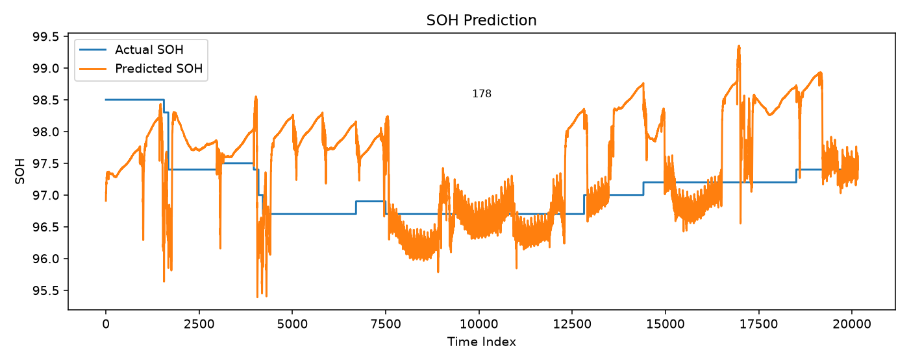
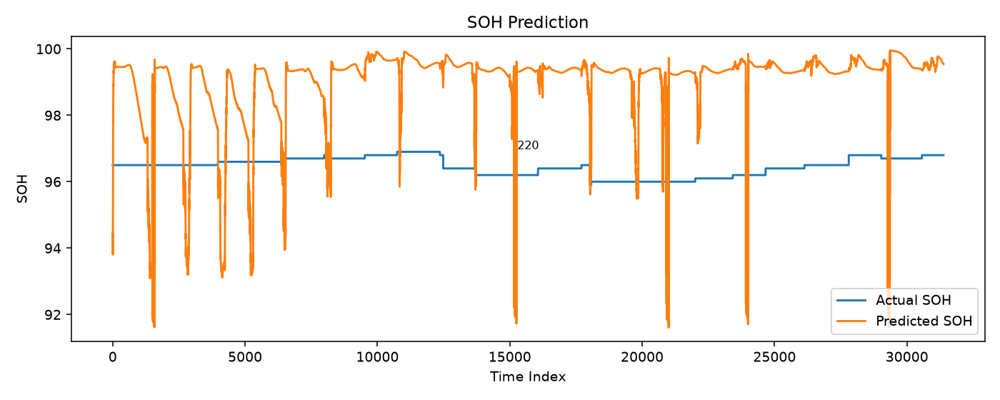

# PatchTST Experiment Report

> 실험 비교 중 **Known-vehicle best**: `run7b_norm_bias` (MAE **0.647**)  
> **New-vehicle (220)**: zero-shot 2.751 → Test-head 5% bias 캘리브 시 **1.198**  
> 배포 규칙: [`DEPLOYMENT.md`](../DEPLOYMENT.md)

## Dataset
- 사용 데이터 : 01241225178.csv.gz, 01241225211.csv.gz, 01241225220.csv.gz, 01241225226.csv.gz
- 데이터 기간 : 2022-12-15 ~ 2023-08-31 (`msg_time` 기준)
- 차량 수 : 4
- Feature : soc, socd, pack_volt, pack_current, batt_pw, mod_avg_temp, mod_max_temp, mod_min_temp, batt_internal_temp, ext_temp, int_temp, cell_volt_dispersion, max_cell_volt, min_cell_volt, odometer, chrg_cnt, cumul_energy_chrgd, cumul_pw_chrgd, insul_resistance, sub_batt_volt
- Target : soh

## Environment
- Python : 3.12.3 / PyTorch : 2.13.0+cu130 / CUDA : 13.0 / GPU : NVIDIA GB10

---

## 1. Leave-one-vehicle-out (우선 검증)

설정: global scaler, bias 보정 없음, per-vehicle norm 없음 (새 차량 가정). run2_fast와 동일 하이퍼파라미터(ep=8, stride 10/8).

| Holdout | Train vehicles | Holdout Test MAE | In-dist 참고 (run2_fast 해당 차) |
|---------|----------------|-----------------:|--------------------------------:|
| **178** | 211, 220, 226 | **0.710** | 1.101 |
| **220** | 178, 211, 226 | **2.751** | 1.771 |

### 판정
- **178**: 미학습 상태에서도 MAE 0.71 → 어느 정도 전이 가능. 오히려 joint 학습에 넣으면 해당 차 성능이 나빠질 수 있음.
- **220**: 미학습 시 MAE **2.75** (in-dist 1.77보다 악화) → **새 차량으로 못 씀**.
- 결론: `run7b` best는 **차량 ID를 알고 val로 bias/norm을 맞춘 파이프라인**이지, zero-shot 일반화가 아님.

### Graphs

---

## 2. Vehicle embedding (`run8` / `run8b`)

목표: 차량별 norm + bias를 모델 내부 embedding으로 흡수.

| 실험 | 설정 | Test MAE | 220 MAE | 178 MAE |
|------|------|---------:|--------:|--------:|
| run8_vehicle_emb | per-vehicle norm + emb(dim=16), bias 없음 | 0.916 | 1.224 | 1.473 |
| run8b_emb_bias | run8 + val bias 보정 | 0.760 | 0.848 | 1.468 |
| run7b_norm_bias (비교) | norm + bias (emb 없음) | **0.647** | **0.613** | 1.438 |

- Embedding만으로 post-hoc bias를 완전히 대체하지 못함 (run8 0.916 > run7b 0.647).
- emb+bias(0.760)도 run7b보다 못함. Best epoch=1로 과적합 빠름.
- 새 차량(unknown idx=0) 대응은 구조적으로 가능하나, LOVO 220 결과상 embedding 없이도/있어도 **220 domain은 별도 적응 필요**.

---

## 3. 178 집중 진단 (`outputs/analysis_178/`)

기준: `run2_fast` 예측.

### 핵심
| 항목 | 값 |
|------|-----|
| Test bias (pred−true) | **+1.070** (과대추정, 220과 반대) |
| run6 val bias | **−0.122** |
| **부호** | **val↔test 반전** → 보정 시 악화 (1.101→1.204) |
| 상관 | 0.311 |
| Test 내 bias (5분위) | 0.40 → **1.50** (비정상) |

### Feature gap (상위)
- `cumul_energy_chrgd` gap_z **+3.3**, `int_temp`/`ext_temp` **0 고정**(gap_z −3.0/−1.5)
- SOH train→val→test mean drift는 작음 (99.03→98.78→98.70) → **SOH drift가 원인 아님**

상세: `analysis_178/ANALYSIS.md`

---

## 4. Huber + median filter

| 실험 | 설정 | Test MAE | 비고 |
|------|------|---------:|------|
| run9_median | run7b와 동일 + median_k=5 | **0.647** | run7b와 사실상 동일 (스파이크 적음) |
| run9_huber | Huber 학습 + per-vehicle norm + median_k=5 | 0.911 | run7(0.943)과 유사, best 미갱신 |

→ 후처리/Huber는 **모양 안정화용**이며, 현재 MAE bottleneck(레벨 bias)은 못 깎음.

---

## 5. 기존 best 파이프라인 요약

| 실험 | Test MAE | 220 | 178 | 비고 |
|------|---------:|----:|----:|------|
| **run7b_norm_bias** | **0.647** | **0.613** | 1.438 | **현재 best (known-vehicle)** |
| run6_bias_correct | 0.694 | 0.860 | 1.204 | bias only |
| run8b_emb_bias | 0.760 | 0.848 | 1.468 | emb+bias |
| run8_vehicle_emb | 0.916 | 1.224 | 1.473 | emb only |
| run9_huber | 0.911 | 1.200 | 1.367 | Huber+median |
| run7_vehicle_norm | 0.943 | 1.180 | 1.430 | norm only |
| run2_fast | 1.036 | 1.771 | 1.101 | baseline |
| lovo_holdout_178 | 0.710 | — | 0.710 | 새 차량(178) |
| lovo_holdout_220 | 2.751 | 2.751 | — | 새 차량(220) **실패** |

---

## 6. 220 Few-shot 캘리브레이션

베이스: `checkpoints/lovo_holdout_220` (zero-shot MAE 2.751).  
캘리브 = holdout **Test 구간 앞부분**, 평가는 나머지 Test.

| 실험 | 설정 | Eval MAE | vs zero-shot |
|------|------|---------:|-------------:|
| lovo_holdout_220 | zero-shot | 2.751 | — |
| **calib_220_testh_f5** | Test 5% + bias | **1.198** | **−56%** |
| calib_220_testh_f10 | Test 10% + bias | 1.291 | −53% |
| calib_220_testh_f20 | Test 20% + bias | 1.398 | −49% |
| calib_220_testh_f10_ft5 | Test 10% + FT5 + bias | 1.252 | −55% (FT raw≈1.07) |

> 전체 시계열 초반 캘리브(`calib_220_f*`)는 bias≈−7로 **악화(MAE>5)** → 사용 금지.  
> Fine-tune 후 raw가 좋으면 bias 생략을 검토.

---

## 7. 178 온도 feature 재처리 (`--fix_zero_temp`)

178의 `int_temp`/`ext_temp` 0 고정을 `mod_min_temp` 등으로 대체 후 재학습.

| 실험 | 설정 | Test MAE | 178 MAE | 비고 |
|------|------|---------:|--------:|------|
| run2_fast | baseline | 1.036 | 1.101 | |
| **run10_fix_temp** | fix_zero_temp, bias 없음 | **0.922** | **0.546** | 178 크게 개선 |
| run10b_fix_temp_bias | + val bias | 0.775 | 1.079 | 178은 보정으로 다시 악화 |
| run10c_fix_temp_norm_bias | + per-vehicle norm + bias | 0.722 | 1.461 | known-best(0.647)에는 미달 |
| run7b_norm_bias | (비교) | **0.647** | 1.438 | known best 유지 |

→ 178 단독 개선에는 `fix_zero_temp`가 유효. 전체 best 교체는 아직 `run7b`.

---

## 8. 실험 비교 (전체)

| 실험 | 설정 | Test MAE | Test RMSE |
|------|------|---------:|----------:|
| **run7b_norm_bias** | **차량별 norm + bias** | **0.647** | **0.855** |
| run9_median | run7b + median_k=5 | 0.647 | 0.855 |
| run6_bias_correct | run2 + bias | 0.694 | 0.851 |
| lovo_holdout_178 | holdout 178 | 0.710 | 0.879 |
| run10c_fix_temp_norm_bias | temp fix + norm + bias | 0.722 | 0.916 |
| run8b_emb_bias | emb + norm + bias | 0.760 | 0.942 |
| run10b_fix_temp_bias | temp fix + bias | 0.775 | 1.030 |
| run10_fix_temp | temp fix | 0.922 | 1.271 |
| run2_fast | baseline | 1.036 | 1.236 |
| **calib_220_testh_f5** | 220 Test 5% bias | **1.198** | 1.365 |
| lovo_holdout_220 | holdout 220 zero-shot | 2.751 | 2.829 |

---

## Observation

### 좋았던 점
- Known-vehicle 파이프라인으로 MAE **1.036 → 0.647**.
- LOVO로 “새 차량 가능 여부”를 수치로 분리: 178은 가능 쪽, **220은 불가**.
- 220 few-shot(Test 5% bias)로 **2.751 → 1.198**.
- `--fix_zero_temp`로 178 MAE **1.101 → 0.546** (bias 없이).

### 아쉬웠던 점
- Vehicle embedding / Huber / median은 best를 못 넘김.
- 전체 시계열 초반 캘리브는 bias 비정상으로 악화 → **Test head만** 사용.
- 178은 temp fix 후에도 val bias 보정 시 다시 악화(부호 반전).

### 운영 결론
- Known: `run7b_norm_bias` 유지.
- Unknown: Test 5~10% 라벨 캘리브(bias) 필수. 상세는 `DEPLOYMENT.md`.
- 178형 0-온도 차량: `--fix_zero_temp` 켜고, **상수 bias는 신중히**.
