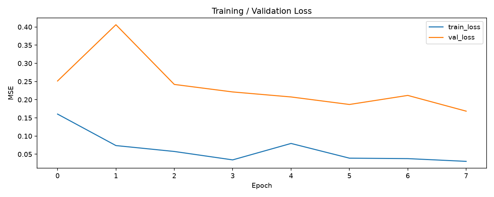
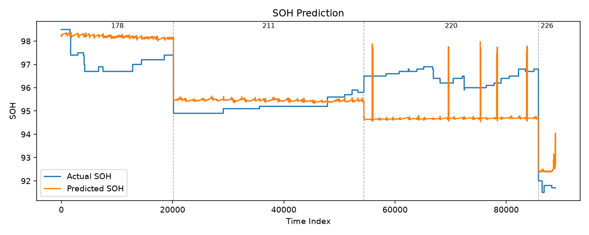

# PatchTST Experiment Report

> 실험 비교 중 **Test MAE 기준 best**: `run2_fast` (Best Epoch 8)  
> 체크포인트: `checkpoints/run2_fast/best_model.pt`

## Dataset
- 사용 데이터 : 01241225178.csv.gz, 01241225211.csv.gz, 01241225220.csv.gz, 01241225226.csv.gz
- 데이터 기간 : 2022-12-15 ~ 2023-08-31 (`msg_time` 기준)
- 차량 수 : 4
- Feature : soc, socd, pack_volt, pack_current, batt_pw, mod_avg_temp, mod_max_temp, mod_min_temp, batt_internal_temp, ext_temp, int_temp, cell_volt_dispersion, max_cell_volt, min_cell_volt, odometer, chrg_cnt, cumul_energy_chrgd, cumul_pw_chrgd, insul_resistance, sub_batt_volt
- Target : soh

## Environment
- Python : 3.12.3
- PyTorch : 2.13.0+cu130
- CUDA : 13.0
- GPU : NVIDIA GB10

## Hyperparameters (`run2_fast`)

| Parameter | Value |
|-----------|------|
| seq_len | 96 |
| pred_len | 1 |
| patch_len | 16 |
| stride | 8 |
| sample_stride | 10 |
| window_stride | 8 |
| batch_size | 128 |
| learning_rate | 0.001 |
| epochs | 8 |
| best_epoch | 8 |

## Result (`run2_fast`)

> Validation loss 기준 **Best Epoch = 8** (val_loss=0.168447) 체크포인트로 Test 평가.

| Metric | Value |
|---------|------|
| MAE | 1.036249 |
| MSE | 1.527275 |
| RMSE | 1.235830 |
| Best Val Loss (scaled MSE) | 0.168447 |

### 실험 비교

| 실험 | sample_stride | window_stride | epochs | best_epoch | Test MAE | Test RMSE | 비고 |
|------|-------------:|-------------:|-------:|-----------:|---------:|----------:|------|
| **run2_fast (best)** | **10** | **8** | **8** | **8** | **1.036** | **1.236** | **최고 성능** |
| run3_finer | 5 | 4 | 10 | 2 | 1.101 | 1.388 | 세밀 샘플링 |
| run3 | 5 | 4 | 15 | 3 | 1.101 | 1.356 | lr=5e-4 |

### Epoch별 Loss (`run2_fast`)

| Epoch | train_loss | val_loss |
|------:|----------:|---------:|
| 1 | 0.160405 | 0.251434 |
| 2 | 0.073798 | 0.406135 |
| 3 | 0.057567 | 0.241940 |
| 4 | 0.034431 | 0.221282 |
| 5 | 0.079624 | 0.207496 |
| 6 | 0.039174 | 0.186788 |
| 7 | 0.037912 | 0.211732 |
| 8 | 0.030380 | 0.168447 **(best)** |

### 차량별 Test 성능 (`run2_fast`)

| 차량 ID | MAE | RMSE | n |
|---------|----:|-----:|--:|
| 01241225178 | 1.1007 | 1.1734 | 20157 |
| 01241225211 | 0.3588 | 0.3886 | 34241 |
| 01241225220 | 1.7712 | 1.7968 | 31381 |
| 01241225226 | 0.6559 | 0.6865 | 3062 |

## Graphs (`run2_fast`)

### Training / Validation Loss

### SOH Prediction (Actual vs Predicted)

## Observation

### 좋았던 점
- `run2_fast`에서 validation loss가 Epoch 8에 최저(0.168)로 떨어졌고, Test MAE **1.036** / RMSE **1.236**을 확보함.
- 차량 `01241225211`은 MAE 0.359로 상대적으로 잘 맞춤.
- 세밀 샘플링(`run3`, `run3_finer`)보다 기본 다운샘플 설정(`run2_fast`)이 전체 Test 지표에서 더 좋음.

### 아쉬웠던 점
- 차량 `01241225220` MAE 1.771로 전체 성능을 크게 끌어올림.
- Epoch 2에서 val_loss가 급등(0.406)하는 등 학습 곡선이 불안정한 구간이 있음.
- SOH의 stair-step 패턴을 세밀하게 따라가지 못하고 평균 수준에 머무는 구간이 있음.

### 다음 실험
- Early stopping + LR scheduler로 val_loss 급등 구간 완화
- `01241225220` 중심 오차 분석 (feature/구간 bias 보정)
- seq_len / patch_len 변경 및 차량별 fine-tuning 비교
