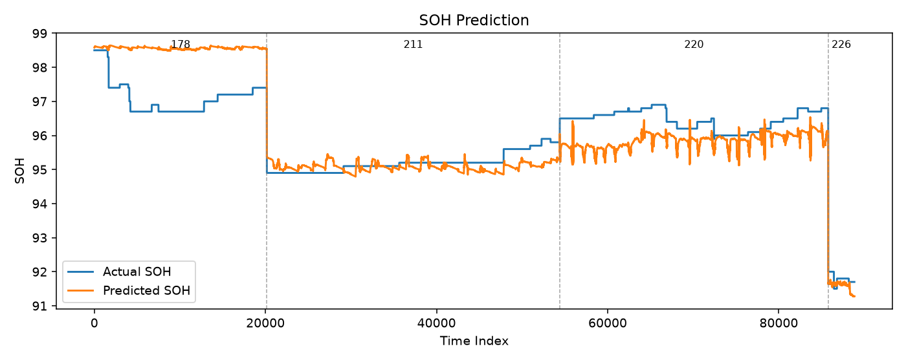
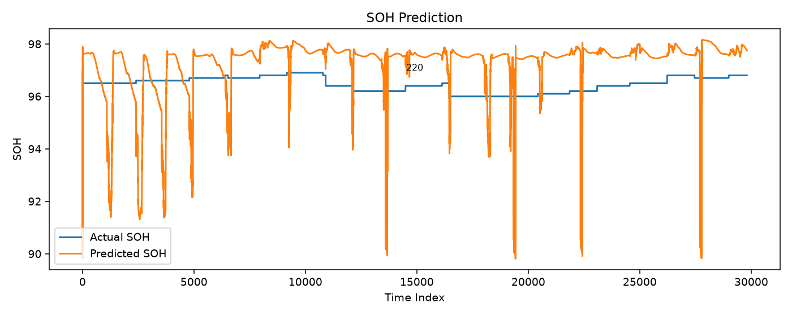

# PatchTST SOH 학습 결과 공유용

> 짧게 말할 때 이 문서만 열면 됩니다. (상세 실험: [`Experiment_Report.md`](Experiment_Report.md))

---

## 한 줄 요약

전기차 충전 시계열로 **PatchTST → SOH 예측**.  
알려진 차는 MAE **0.65** (정확도 **99.4%**), 새 차(220)는 zero-shot **2.75** (97.3%) → **5% 캘리브로 1.20** (98.8%).

---

## 말할 멘트 (약 40초)

> 충전 구간 시계열로 PatchTST로 배터리 SOH를 예측했습니다.  
> 기본 모델 MAE는 **1.04**(정확도 99.0%)였고, 차량별 정규화와 bias 보정으로 **0.65**(99.4%)까지 내렸습니다.  
> 다만 차량을 빼고 테스트하면(새 차량 가정) 220호는 **2.75**(97.3%)로 크게 나빠집니다.  
> Test 앞부분 **5% 라벨만**으로 bias를 맞추면 **1.20**(98.8%)까지 회복됩니다.  
> 그래서 운영은 **알려진 차 = 보정 파이프라인**, **새 차 = 짧은 캘리브레이션**으로 가져가면 됩니다.

---

## 핵심 숫자 (이 표만 보여줘도 됨)

| 구분 | 실험 | Test MAE | 정확도 | 의미 |
|------|------|---------:|-------:|------|
| Baseline | `run2_fast` | 1.036 | 99.0% | 기본 학습 |
| **Known best** | `run7b_norm_bias` | **0.647** | **99.4%** | 차량별 norm + bias |
| New-vehicle 실패 | `lovo_holdout_220` | **2.751** | 97.3% | 220 제외 학습 → zero-shot |
| **New-vehicle 회복** | `calib_220_testh_f5` | **1.198** | **98.8%** | Test 5% + bias 캘리브 |

> **정확도(%) = 100 − MAE** — SOH가 0~100% 스케일이므로 MAE(%p)를 빼면 평균 예측 정확도로 해석 가능.

```text
MAE:     1.04  →  0.65  →  (새 차) 2.75  →  (캘리브) 1.20
정확도:  99.0% → 99.4% →         97.3%  →           98.8%
         기본      known           zero-shot              5% bias
```

---

## 학습 방법 (`train.py`)

엔트리포인트: `python train.py` (`data/` CSV 4대, 예측 타깃 `soh`)

### 1) 데이터 → 윈도우

| 단계 | 내용 |
|------|------|
| 입력 | `data/*.csv.gz` 4대 (178, 211, 220, 226) |
| Feature | 아래 **20개** (기본값, `--feature_cols` 미지정 시) |
| 예측 타깃 | `soh` |
| 다운샘플 | `sample_stride=10` (10행마다 1행) |
| 시계열 분할 | 차량별 **시간순** train 70% / val 15% / test 15% |
| 윈도우 | `seq_len=96`, `window_stride=8` 슬라이딩 (차량 경계 안 넘김) |
| 정규화 | global `StandardScaler` (기본) 또는 `--per_vehicle_norm` (차량별 scaler) |

**입력 feature 20개** (`utils.DEFAULT_FEATURE_COLS`, 예측 타깃 `soh` 제외):

| # | 컬럼명 | 설명 |
|---|--------|------|
| 1 | `soc` | 충전 상태 (State of Charge) |
| 2 | `socd` | SOC 변화율 |
| 3 | `pack_volt` | 팩 전압 |
| 4 | `pack_current` | 팩 전류 |
| 5 | `batt_pw` | 배터리 출력 |
| 6 | `mod_avg_temp` | 모듈 평균 온도 |
| 7 | `mod_max_temp` | 모듈 최대 온도 |
| 8 | `mod_min_temp` | 모듈 최소 온도 |
| 9 | `batt_internal_temp` | 배터리 내부 온도 |
| 10 | `ext_temp` | 외부 온도 |
| 11 | `int_temp` | 실내 온도 |
| 12 | `cell_volt_dispersion` | 셀 전압 편차 |
| 13 | `max_cell_volt` | 최대 셀 전압 |
| 14 | `min_cell_volt` | 최소 셀 전압 |
| 15 | `odometer` | 주행거리 |
| 16 | `chrg_cnt` | 충전 횟수 |
| 17 | `cumul_energy_chrgd` | 누적 충전 에너지 |
| 18 | `cumul_pw_chrgd` | 누적 충전 전력 |
| 19 | `insul_resistance` | 절연 저항 |
| 20 | `sub_batt_volt` | 보조 배터리 전압 |

> 결측 20% 초과 컬럼은 자동 제외. 178호는 `int_temp`/`ext_temp`가 0 고정 → `--fix_zero_temp` 시 `mod_avg_temp` 등으로 대체.

### 2) 모델 & 학습 루프

- **모델**: `PatchTSTRegressor` — patch_len=16, stride=8, d_model=128, 3 layers, 8 heads
- **손실**: MSE (기본), AdamW lr=1e-3, batch=128
- **스케줄**: `ReduceLROnPlateau` (val_loss 2 epoch 미개선 시 LR×0.5)
- **체크포인트**: val_loss 최저 epoch → `checkpoints/*/best_model.pt`
- **실험 공통**: epochs=8, dropout=0.1 (`run2_fast` 기준)

```bash
# Baseline (run2_fast)
python train.py --data_dir data --epochs 8 \
  --output_dir outputs/run2_fast --checkpoint_dir checkpoints/run2_fast
```

### 3) 예측 후처리 (known-vehicle best)

`run7b_norm_bias` (MAE 0.65)는 **학습 없이** 기존 체크포인트 + 후처리만 적용:

```bash
python train.py --eval_checkpoint checkpoints/run7_vehicle_norm/best_model.pt \
  --per_vehicle_norm --vehicle_bias_correct \
  --output_dir outputs/run7b_norm_bias
```

| 옵션 | 역할 |
|------|------|
| `--per_vehicle_norm` | 차량별 train split으로 feature/target scaler 따로 fit |
| `--vehicle_bias_correct` | val에서 차량별 bias(예측−실제 평균) 추정 → test 예측에서 차감 |

### 4) 새 차량 (LOVO) & 캘리브레이션

| 실험 | train.py 핵심 옵션 | 설명 |
|------|-------------------|------|
| `lovo_holdout_220` | `--holdout_vehicle 220` | 220을 train/val에서 제외, test만 평가. bias 보정 **끔** (zero-shot) |
| `calib_220_testh_f5` | `--holdout_vehicle 220 --calibrate_frac 0.05 --eval_checkpoint ...` | 220 test **앞 5%**로 bias 추정, 나머지 95% 평가. fine-tune 없음 |

```bash
# LOVO zero-shot
python train.py --holdout_vehicle 220 --epochs 8 \
  --no-vehicle_bias_correct \
  --output_dir outputs/lovo_holdout_220

# Test 5% bias 캘리브 (학습 생략, 기존 LOVO 체크포인트 사용)
python train.py --holdout_vehicle 220 --calibrate_frac 0.05 \
  --eval_checkpoint checkpoints/lovo_holdout_220/best_model.pt \
  --output_dir outputs/calib_220_testh_f5
```

> LOVO + `calibrate_frac`일 때 bias는 val이 아니라 **캘리브 구간**에서 추정. `finetune_epochs>0`이면 캘리브 구간으로 추가 fine-tune 가능.

### 5) 파이프라인 한눈에

```text
CSV(4대) → 시간분할(7:1.5:1.5) → StandardScaler → 슬라이딩윈도우(96)
    → PatchTST 학습(MSE, AdamW) → best checkpoint
    → [선택] per-vehicle norm
    → [선택] val/calib bias 보정
    → test MAE 평가 + prediction.png 저장
```

---

## 보여줄 그래프

### 1) Known-vehicle (잘 되는 경우)

`run7b` — 차량별 정규화 + validation bias 보정



### 2) New-vehicle zero-shot (실패)

220을 학습에서 빼고 바로 예측 → level이 크게 어긋남


### 3) New-vehicle + 5% 캘리브 (회복)

Test 앞 5%로 bias만 맞춘 뒤 나머지 평가



---

## 운영 결론 (질문 나오면)

| 차량 유형 | 방법 | 기대 MAE | 기대 정확도 |
|-----------|------|---------:|------------:|
| 알려진 차량 | per-vehicle norm + val bias (`run7b`) | ≈ **0.65** | ≈ **99.4%** |
| 새 차량 | Test(운영) 앞 **5~10%** 라벨로 bias 캘리브 | 220 기준 **2.75 → 1.20** | **97.3% → 98.8%** |

상세 규칙: [`../DEPLOYMENT.md`](../DEPLOYMENT.md)

---

## Q&A 짧게

| 질문 | 답 |
|------|----|
| 왜 차량별로 나눠? | 차마다 SOH level bias가 다름 (특히 220은 체계적 저추정) |
| Embedding/Huber는? | 시도했지만 known best(0.65)를 못 넘김 |
| 178은? | 온도 0 고정 → `--fix_zero_temp`로 해당 차 MAE 1.10→0.55 개선. 전체 best는 여전히 run7b |
| 다음에 뭐 하면? | 새 차 캘리브 길이(일 단위) 현장 기준 확정, 178형 시간 가변 bias |

---

## 파일 위치

| 용도 | 경로 |
|------|------|
| 이 공유 자료 | `outputs/Share_Summary.md` |
| 전체 실험 리포트 | `outputs/Experiment_Report.md` |
| 배포 프로토콜 | `DEPLOYMENT.md` |
| Known best 그래프 | `outputs/run7b_norm_bias/prediction.png` |
| 220 zero-shot | `outputs/lovo_holdout_220/prediction.png` |
| 220 캘리브 | `outputs/calib_220_testh_f5/prediction.png` |
